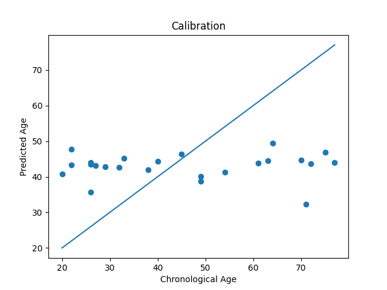
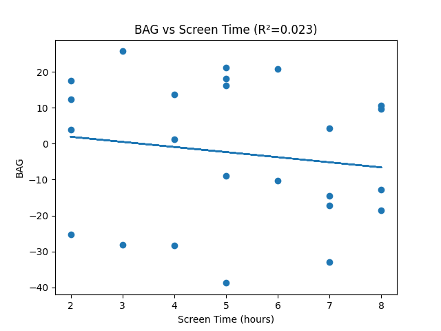
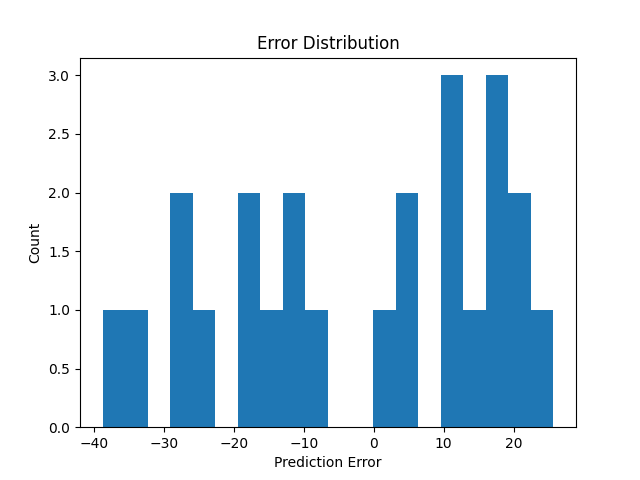
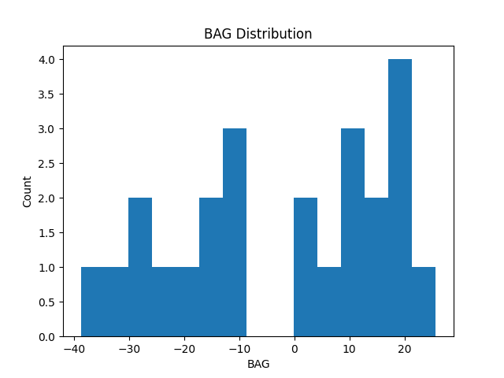

#  Brain Age Prediction using MRI and Screen Time Correlation

###  Project Overview
This project aims to study how daily screen time may influence the rate of brain aging.  
By analyzing preprocessed MRI scans from the IXI dataset, a deep learning model is trained to estimate *brain age* — the biological age of the brain — and compare it with a person’s actual chronological age.  
The difference between these two values, known as the *Brain Age Gap (BAG)*, is then correlated with daily screen time data to explore possible links between digital exposure and neurobiological aging.

---

###  Objectives
- Build a deep learning model to estimate *brain age* from MRI data.  
- Compute the *Brain Age Gap (BAG)* for each individual.  
- Collect and integrate *screen time* data for behavioral comparison.  
- Study correlations between *BAG* and *screen time exposure*.  
- Understand whether prolonged digital device usage might contribute to accelerated or delayed brain aging.

---

###  Dataset
*Source:* [Preprocessed OASIS, Epilepsy, and IXI MRI Dataset (Kaggle)](https://www.kaggle.com/datasets/hamedamin/preprocessed-oasis-and-epilepsy-and-ixi?select=a.rar)

- MRI data is already cleaned, skull-stripped, and normalized.  
- The IXI subset (healthy subjects) is used for model training.  
- Screen time data is manually entered via a CSV file (screen_time_metadata.csv).  
---

###  Methodology
1. *Data Loading & Preprocessing*
   - MRI files are loaded in NIfTI format using nibabel.
   - Volumes are resized to (64, 64, 64, 1) and normalized.

2. *Model Architecture*
   - A *3D Convolutional Neural Network (CNN)* inspired by the *Temporal Slice Attention Network (TSAN)* is implemented.
   - Architecture: Conv3D → MaxPool3D → Conv3D → GlobalAveragePooling3D → Dense.
   - Optimizer: Adam | Loss: MSE | Metric: MAE

3. *Training & Validation*
   - 80% of data used for training, 20% for testing.
   - Early stopping applied to prevent overfitting.
   - Final model saved as brain_age_cnn.h5.

4. *Analysis & Visualization*
   - BAG = Predicted Age − Chronological Age  
   - Regression and correlation analysis between BAG and screen time.
   - Visualizations include calibration curve, BAG histogram, and error distribution.

---

### Results Summary
| Metric | Value |
|:--|:--|
| Test MAE | ≈ 17.1 |
| RMSE | ≈ 23.4 |
| R² (Screen Time vs BAG) | 0.022 |
| Correlation Slope | –1.42 |

 *Interpretation:*  
The model shows a small negative correlation between screen time and brain age gap.  
This suggests that higher daily screen exposure may slightly increase the brain’s apparent aging rate, though the effect is not strong.  
Further studies on larger and more diverse datasets are needed for validation.

---

### Applications
- *Healthcare:* Early detection of abnormal brain aging from MRI.  
- *Education:* Studying digital exposure effects on young learners.  
- *Workplace Health:* Tracking mental fatigue linked to excessive screen usage.  
- *Research:* Using brain age as a biomarker for cognitive health.

---

### Tools & Libraries
- *Python 3.10*  
- *TensorFlow / Keras*  
- *NumPy, Pandas, Matplotlib, Scikit-learn*  
- *Nibabel* for MRI data handling  

---

###  Project Files
| File | Description |
|------|--------------|
| Brain_Age_Prediction_Final.ipynb | Main Colab notebook |
| screen_time_metadata.csv | Screen time data per subject |
| brain_age_cnn.h5 | Saved CNN model |
| fig_bag_hist.png | BAG Distribution |
| fig_bag_vs_st.png | Screen Time vs BAG correlation |
| fig_error_hist.png | Prediction error histogram |

---

### 📊 Results and Visualizations

*1️ Calibration Curve (Predicted vs Actual Age)*

*2️ BAG vs Screen Time Correlation*

*3️ Error Distribution*

*4️ BAG Distribution*

---

###  Author

*Khushi Tyagi*  
B.Tech Student, *University of Petroleum and Energy Studies (UPES), Dehradun*  

---

###  Run on Google Colab

---

